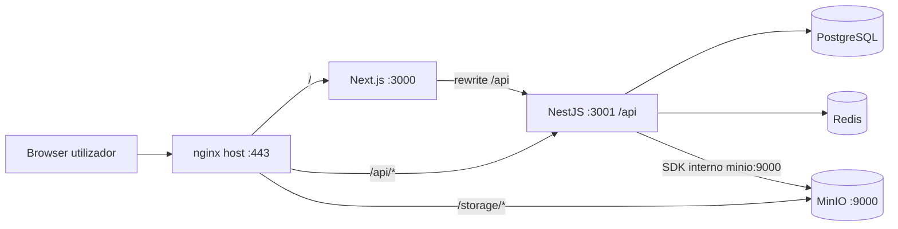
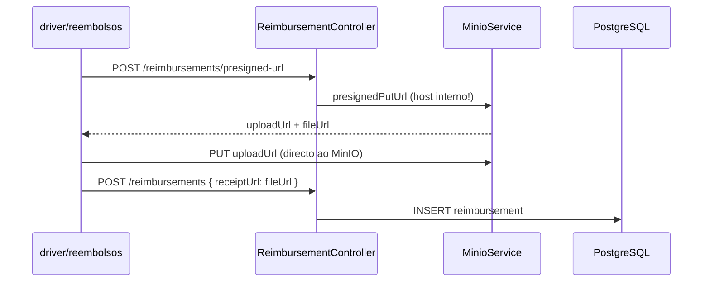

# Arquitetura API e fluxos — referência para auditoria VPS

Como o **frontend**, **backend NestJS**, **PostgreSQL**, **Redis**, **MinIO** e **nginx** interagem no Sistema UPGRADE. Base para entender BUG-01, BUG-20, BUG-21 e fluxos de professor/motorista.

---

## Visão geral



| Camada | Tecnologia | Prefixo / porta |
|--------|------------|-----------------|
| UI | Next.js 14 App Router | `http://localhost:3010` (dev) ou `:3000` (Docker prod) |
| API | NestJS 10 | **`/api`** global (`main.ts`) |
| Docs | Swagger | `/api/docs` |
| BD | Prisma + PostgreSQL | `:5432` |
| Ficheiros | MinIO (S3-compatible) | API `:9000` / browser via nginx **`/storage/`** |
| Tempo real | Socket.IO | namespace `/notifications` |

Documentação alinhada: [`../sistema-atual/03-arquitetura-backend.md`](../sistema-atual/03-arquitetura-backend.md), [`../sistema-atual/04-frontend-portais-e-rotas.md`](../sistema-atual/04-frontend-portais-e-rotas.md), [`../sistema-atual/07-integracoes-notificacoes-arquivos-mapa.md`](../sistema-atual/07-integracoes-notificacoes-arquivos-mapa.md).

---

## Cliente HTTP no frontend

- Ficheiro: `frontend/lib/api/client.ts`
- Base URL: `NEXT_PUBLIC_API_URL` (ex.: `https://sistemaupgrade.com.br/api` em prod)
- Em dev local, `frontend/next.config.js` faz **rewrite** de `/api/*` → `BACKEND_URL/api/*`
- Token JWT: header `Authorization: Bearer …` (Zustand `auth-storage`, **não** `localStorage.getItem('user')` — ver BUG-07 histórico)

---

## Autenticação e rate limit

| Endpoint | Módulo | Notas |
|----------|--------|-------|
| `POST /api/auth/login` | `AuthModule` | Pode exigir OTP e/ou TOTP conforme `.env` |
| `POST /api/auth/verify-email-otp` | Auth | Alvo do **BUG-02** (Throttler) |
| `GET /api/users/me` | `UsersModule` | Perfil + `twoFactorEnabled` + relações (`student`, etc.) |

**BUG-02:** Em VPS, sem `trust proxy`, todos os pedidos parecem vir do IP do nginx → throttle global satura.

- Correção no código: `backend/src/main.ts` → `app.set('trust proxy', 1)`
- Nginx deve enviar `X-Forwarded-For` / `X-Real-IP` no bloco do backend

---

## Armazenamento de ficheiros (crítico para BUG-01, 20, 21)

### Três padrões no backend

| Padrão | Serviço | Bucket típico | URL gravada na BD |
|--------|---------|---------------|-------------------|
| Upload público directo | `PublicUploadService` | `public-uploads` | `MINIO_PUBLIC_BROWSER_URL/...` ou host:9010 |
| Presigned PUT + URL estável | `reimbursement/MinioService`, `feedbacks`, `trips` | `reimbursements`, `feedbacks`, `reports` | `http(s)://{MINIO_ENDPOINT}:{port}/{bucket}/{key}` |
| Presigned GET para visualizar | `presignedGetUrl` nos services | — | URL temporária com `X-Amz-*` |

### Problema central (BUG-20)

O cliente MinIO é criado com:

```typescript
endPoint: process.env.MINIO_ENDPOINT || 'localhost'  // em Docker prod: "minio"
port: parseInt(process.env.MINIO_PORT || '9000', 10)
```

`presignedGetObject` / `presignedPutObject` **assinam o hostname do cliente**. Se `MINIO_ENDPOINT=minio`, o browser recebe `http://minio:9000/...` → **NXDOMAIN**.

**Correção recomendada:**

1. Manter cliente **interno** (`minio:9000`) só para `putObject` / admin
2. Cliente ou opções **públicas** para presign: host `sistemaupgrade.com.br`, path `/storage`, ou variável `MINIO_PUBLIC_SIGN_HOST`
3. Gravar na BD URLs já no formato browser: `https://sistemaupgrade.com.br/storage/{bucket}/{key}` (como faz `PublicUploadService.buildBrowserObjectUrl`)

`docker-compose.prod.yml` já define:

```yaml
MINIO_PUBLIC_BROWSER_URL: https://sistemaupgrade.com.br/storage
```

mas **só** `PublicUploadService` usa isto; reembolsos/imprevistos presigned **não**.

### Nginx (BUG-01)

Ficheiro de referência: `nginx/sistemaupgrade.conf`

```nginx
location /storage/ {
    proxy_pass http://127.0.0.1:9000/;
}
```

- Pedidos públicos: `https://sistemaupgrade.com.br/storage/public-uploads/anon/...`
- Se nginx apontar porta errada (ex. 9010 no host sem listener) → **502**

### Proxy Next (opcional)

Alguns fluxos esperam que imagens passem por `/storage/*` no mesmo domínio do frontend. Confirmar se existe rewrite no deploy VPS do Next (não está em `next.config.js` actual — só `/api`).

---

## Fluxo: novo reembolso com foto (BUG-21)



Pontos de falha:

1. `uploadUrl` com hostname `minio` → PUT falha no browser (silencioso no FE: `catch { /* continua sem URL */ }`)
2. `fileUrl` gravada com host errado → visualização quebra (BUG-20)
3. Sem foto: registo criado sem `receiptUrl` → "Nenhum documento anexado"

Ficheiros:

- `frontend/app/driver/reembolsos/page.tsx` (linhas ~136–147)
- `backend/src/reimbursement/reimbursement.service.ts` → `getPresignedUploadUrl`
- `backend/src/reimbursement/minio.service.ts`

---

## Fluxo: imprevisto com documento (BUG-21 + BUG-20)

Portal professor (`frontend/app/teacher/imprevistos/page.tsx`):

1. Usa **`POST /reimbursements/presigned-url`** (bucket `reimbursements`) — **não** endpoint de absences
2. Grava URL em `documentUrl` via `POST /absences`
3. Visualização admin: `GET /absences/:id/document-presigned-url` → `presignedGetUrl` → de novo hostname interno

Ficheiros:

- `backend/src/absences/absences.service.ts` → `create`, `getDocumentPresignedViewUrl`
- `backend/src/absences/absences.controller.ts`

---

## Fluxo: professor — dashboard e vínculo turma (BUG-19)

### Dashboard

| Passo | Chamada | Ficheiro backend |
|-------|---------|------------------|
| Carregar KPIs/turmas | `GET /api/classes/teacher/dashboard` | `classes.service.ts` → `getTeacherDashboard` |
| Ponto entrada | `POST /api/teachers/me/checkin` | `users.service.ts`, `teachers.controller.ts` |
| Ponto saída | `POST /api/teachers/me/checkout` | idem (**MEL-07** implementado) |

`getTeacherDashboard` filtra turmas `IN_PROGRESS` onde existe `ClassTeacher` com `teacher.userId = req.user.id`.

Se o professor **não** tiver registo na tabela `teachers` ou **não** estiver em `class_teachers`, o dashboard fica vazio (não é necessariamente 500).

### Vincular professor à turma (admin)

| Passo | Chamada | Problema conhecido |
|-------|---------|-------------------|
| UI seleciona utilizador | `selectedTeacherId` = **User.id** | `TurmaDetailWorkspace.tsx` |
| API | `POST /classes/:classId/teachers/:teacherId` | `classes.service.ts` |
| Backend valida | `prisma.teacher.findUnique({ where: { id: teacherId }})` | Espera **Teacher.id**, não User.id → **404 Teacher not found** |

**Correção necessária:** resolver `userId` → `teacher.id` no service ou enviar `teacher.id` no frontend (via `GET /employees/search?userId=` ou incluir `teacherId` na lista de professores).

---

## Fluxo: frequência admin (BUG-16)

| Chamada | Controller | Service |
|---------|------------|---------|
| `GET /api/employees/attendance/unified?date=YYYY-MM-DD&role=TEACHER` | `employees.controller.ts` | `getUnifiedAttendance` |

Mapeamento de role:

- Query `TEACHER` → filtro Prisma `employee.role = INSTRUCTOR`
- Professores precisam existir em `employees` com `user` ligado e role coerente
- Erro 500 em VPS: ver logs Prisma (migration em falta, tabela `teacher_checkins`, etc.)

---

## Fluxo: diárias em período de curso (BUG-05)

| Passo | Onde |
|-------|------|
| Vincular funcionário à ação | Admin → Período de curso → Funcionários |
| Cálculo dias | `backend/src/acoes/acoes.service.ts` |
| Utilitário | `backend/src/common/calcular-dias-efetivos.util.ts` |
| Política | `ClassWeekendPolicy` no curso/turma + feriados |

Deve usar **mesma função** no preview (card) e no lançamento `ContaPagar` tipo `diaria_funcionario`.

---

## Fluxo: feriados (BUG-15)

| Acção | Endpoint / ficheiro |
|-------|---------------------|
| Pré-carregar nacionais | Loop no FE `admin/feriados/page.tsx` → `handlePreloadNacional` |
| Pré-carregar estaduais | `POST /holiday/preload-state-holidays` |
| Guard | Exige turmas `IN_PROGRESS` — **lógica invertida** vs negócio |

Feriados devem ser globais ou por UF **sem** exigir turma activa para o seed inicial.

---

## Fluxo: viagens manuais (MEL-10)

| Componente | Ficheiro |
|------------|----------|
| UI admin | `frontend/app/admin/viagens/page.tsx` |
| API | `backend/src/trips/trips.controller.ts`, `trips.service.ts` |
| Validação CEP/coords | Falha se geocode não devolver lat/long |

Proposta de produto (auditoria): gerar viagem a partir de Período de Curso + turma + motorista — ver MEL-10 no mapa completo.

---

## Variáveis de ambiente (produção)

| Variável | Uso |
|----------|-----|
| `DATABASE_URL` | Prisma |
| `JWT_SECRET` | Auth |
| `MINIO_ENDPOINT` | Host **interno** Docker (`minio`) |
| `MINIO_PORT` | `9000` interno |
| `MINIO_PUBLIC_BROWSER_URL` | URLs browser (`https://dominio/storage`) |
| `MINIO_ACCESS_KEY` / `MINIO_SECRET_KEY` | Credenciais |
| `MINIO_BUCKET_REIMBURSEMENT` | Default `reimbursements` |
| `AUTH_BYPASS_MFA` | **Nunca** `true` em produção |
| `BACKEND_URL` | Next rewrites (container → `http://backend:3001`) |
| `NEXT_PUBLIC_API_URL` | Cliente axios no browser |

---

## Checklist de diagnóstico na VPS

```bash
# 1. Migrations
cd backend && npx prisma migrate status

# 2. Logs backend no erro
docker logs upgrade-backend --tail 200

# 3. MinIO acessível no host
curl -I http://127.0.0.1:9000/minio/health/live

# 4. Storage via nginx
curl -I https://sistemaupgrade.com.br/storage/public-uploads/

# 5. Variáveis MinIO no container
docker exec upgrade-backend printenv | grep MINIO
```

---

## Tutoriais relacionados no repositório

| Tema | Documento |
|------|-----------|
| Viagens e presign | [`../sistema-atual/11-modulo-viagens-logistica.md`](../sistema-atual/11-modulo-viagens-logistica.md) |
| Certificados (editor) | `frontend/app/admin/certificados/certificate-tutorial-steps.tsx` |
| Contas a pagar | [`../mapeamentos/CONTAS_A_PAGAR_MAPEAMENTO_E_ROADMAP.md`](../mapeamentos/CONTAS_A_PAGAR_MAPEAMENTO_E_ROADMAP.md) |
| Seeds / login teste | [`../SEEDS_GUIDE.md`](../SEEDS_GUIDE.md) |
| Correções já feitas | [`../AFAZERES/Correções.md`](../AFAZERES/Correções.md) |
