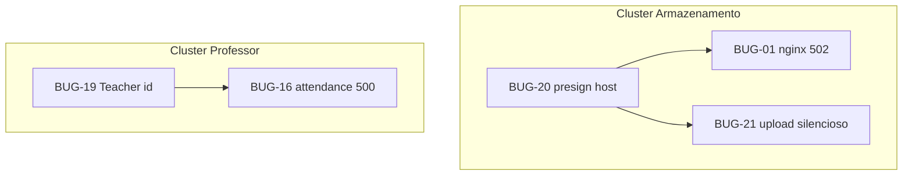
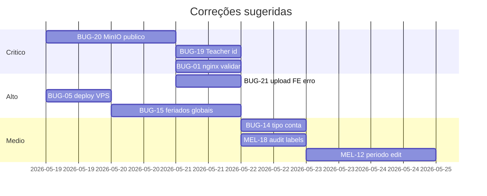

# Mapa completo — Auditoria VPS (BUG-01 … BUG-21)

Inventário **único** dos 21 itens das auditorias v2–v4, com ligação ao código, APIs, estado actual e como corrigir.

**Legenda de estado:** ver [README.md](./README.md).

---

## Índice rápido

| ID | Sev. | Estado no repo | Título curto |
|----|------|----------------|--------------|
| [BUG-01](#bug-01--uploads-502-storage) | CRÍTICO | Parcial / Config VPS | Uploads 502 em `/storage` |
| [BUG-02](#bug-02--throttler-2fa) | ALTO | Corrigido no repo | ThrottlerException no 2FA |
| [MEL-03](#mel-03--duplicação-turma) | MÉDIO | Parcial | Fluxo período → turma duplica curso |
| [MEL-04](#mel-04--status-turma-en) | MÉDIO | Parcial | Status EN em turmas vinculadas |
| [BUG-05](#bug-05--diárias-fins-de-semana) | CRÍTICO | Corrigido no repo | Diárias ignoram política FDS |
| [MEL-06](#mel-06--professor-turma) | MÉDIO | Corrigido no repo | Professor curso → turmas |
| [MEL-07](#mel-07--ponto-entrada-saída) | BAIXO | Corrigido no repo | Check-in único → entrada+saída |
| [MEL-08](#mel-08--certificados-botões) | ALTO | Parcial | Botões certificado / duplicar |
| [BUG-09](#bug-09--layout-reembolsos-motorista) | ALTO | Corrigido no repo | Reembolsos centralizados |
| [MEL-10](#mel-10--viagem-manual-coordenadas) | MÉDIO | Pendente / Produto | Criar viagem bloqueada |
| [BUG-11](#bug-11--manutenção-sem-carreta) | ALTO | Parcial | Modal manutenção sem carreta |
| [MEL-12](#mel-12--editar-período-incompleto) | MÉDIO | Pendente | Edição período ≠ criação |
| [BUG-13](#bug-13--módulos-turma-vazios) | ALTO | Parcial | Módulos do curso (0) na turma |
| [BUG-14](#bug-14--tipo-conta-genérico) | MÉDIO | Pendente | Tipo conta “Funcionário / RH” |
| [BUG-15](#bug-15--feriados-sem-turma) | ALTO | Pendente | Pré-carga feriados exige turma |
| [BUG-16](#bug-16--frequência-professor-500) | ALTO | Corrigido no repo | `/attendance/unified` 500 |
| [MEL-17](#mel-17--foto-perfil) | MÉDIO | Pendente (feature) | Avatar não persiste |
| [MEL-18](#mel-18--relatórios-en) | MÉDIO | Pendente | Histórico em inglês/snake |
| [BUG-19](#bug-19--perfil-professor) | CRÍTICO | Corrigido no repo | Teacher not found / dashboard |
| [BUG-20](#bug-20--presigned-minio-host) | CRÍTICO | Pendente | URL `minio:9000` no browser |
| [BUG-21](#bug-21--upload-criação) | ALTO | Pendente | Anexo não sobe na criação |

---

## Clusters e causa raiz partilhada



| Se corrigir… | Desbloqueia… |
|--------------|--------------|
| BUG-20 (presign + URLs públicas) | BUG-01 visualização, BUG-21 leitura, comprovantes, imprevistos |
| BUG-19 (resolver Teacher.id) | Vínculo turma, possivelmente sintomas de dashboard |
| Deploy/rebuild frontend | BUG-09 regressão de layout na VPS |
| BUG-15 (feriados globais) | Calendário letivo antes de abrir turmas |

---

## v2 — Itens 01 a 08

### BUG-01 — Uploads 502 `/storage`

| Campo | Valor |
|-------|-------|
| **Severidade** | CRÍTICO |
| **Sintoma** | Imagens em cadastros, reembolsos, imprevistos: placeholder; URL `https://sistemaupgrade.com.br/storage/...` → **502** |
| **Estado** | **Parcial** — `PublicUploadService` gera URL pública correcta; presigned e nginx podem falhar na VPS |

**Causa raiz (ligação BUG-20):**

- Ficheiros em `public-uploads` usam proxy nginx → MinIO `:9000`
- Visualização via **presigned GET** usa hostname Docker `minio` → browser não resolve
- 502 = nginx não alcança upstream ou bucket/object inexistente

**Código relevante:**

| Ficheiro | Função |
|----------|--------|
| `nginx/sistemaupgrade.conf` | `location /storage/` → `127.0.0.1:9000` |
| `backend/src/public-upload/public-upload.service.ts` | `buildBrowserObjectUrl`, `MINIO_PUBLIC_BROWSER_URL` |
| `docker-compose.prod.yml` | `MINIO_PUBLIC_BROWSER_URL: https://sistemaupgrade.com.br/storage` |
| `apply-bug01.ts`, `diagnose-bug01.ts` | Scripts diagnóstico/deploy |

**Como corrigir:**

1. Na VPS: `curl -I http://127.0.0.1:9000/minio/health/live`
2. Confirmar nginx `proxy_pass` porta **9000** (não 9010, salvo mapeamento diferente)
3. Aplicar fix BUG-20 para não depender de presigned com host interno
4. Testar URL exacta da evidência após deploy

---

### BUG-02 — Throttler 2FA

| Campo | Valor |
|-------|-------|
| **Severidade** | ALTO |
| **Sintoma** | `ThrottlerException: Too Many Requests` ao reentrar (professor/admin) |
| **Estado** | **Corrigido no repo** |

**Código:**

```139:140:backend/src/main.ts
    // BUG-02: Confiar no Nginx para receber os IPs reais no rate limiting
    app.set('trust proxy', 1);
```

**VPS:** Garantir que o patch está deployado + headers `X-Forwarded-For` no proxy da API. Calibrar `@Throttle()` em rotas de OTP se ainda agressivo.

---

### MEL-03 — Duplicação turma

| Campo | Valor |
|-------|-------|
| **Severidade** | MÉDIO |
| **Sintoma** | Após criar período, abre fluxo que duplica curso/turma indevidamente |
| **Estado** | **Parcial** |

**Código:**

- Criação período + turma: `frontend/app/admin/acoes/page.tsx` (modal “Novo Período”, sub-modal turma ~L216–244)
- Cria turma via `POST /classes` e vincula com `acoesApi.addTurma`

**Gap:** Falta verificar se já existe turma para o `courseId`/período antes de abrir criador; auditoria pede não abrir “criar curso” se curso base já existe.

**Correção:** Antes do modal turma, `GET /acoes/:id` ou listar turmas vinculadas; se `length > 0`, só toast informativo.

---

### MEL-04 — Status turma EN

| Campo | Valor |
|-------|-------|
| **Severidade** | MÉDIO |
| **Sintoma** | Coluna `ENROLLMENT_OPEN` literal em “Turmas Vinculadas” |
| **Estado** | **Parcial** |

**Código com mapa PT:**

```111:119:frontend/app/admin/acoes/[id]/page.tsx
const TURMA_STATUS_CFG: Record<string, string> = {
    PLANNED: 'Planejada',
    ENROLLMENT_OPEN: 'Matrículas Abertas',
    ...
};
```

Usado em selects e tabela (~L339, L362) mas badge ainda `badge-gray` — falta cores iguais a `admin/turmas/page.tsx` (`STATUS_CFG` com neon).

**Correção:** Reutilizar `STATUS_CFG` de `frontend/app/admin/turmas/page.tsx` ou componente partilhado `ClassStatusBadge`.

---

### BUG-05 — Diárias fins de semana

| Campo | Valor |
|-------|-------|
| **Severidade** | CRÍTICO |
| **Sintoma** | 30 dias × diária ignorando `ClassWeekendPolicy` → overpayment |
| **Estado** | **Corrigido no repo** (validar na VPS) |

**Código:**

| Ficheiro | Papel |
|----------|-------|
| `backend/src/common/calcular-dias-efetivos.util.ts` | Contagem por política + feriados |
| `backend/src/acoes/acoes.service.ts` | Uso ao vincular funcionário (~L504–559) |
| `deploy-bug05.ts` | Script deploy VPS |

**Políticas Prisma:** `WEEKDAYS_ONLY`, `FOLLOW_SCHEDULE`, `ALL_WEEKENDS`, `SELECT_WEEKENDS`.

**Validação:** Vincular funcionário com política “só dias úteis”; log deve mostrar `BUG-05: dias calculados...`; valor em Contas a pagar deve bater com dias úteis.

---

### MEL-06 — Professor ↔ turma

| Campo | Valor |
|-------|-------|
| **Severidade** | MÉDIO |
| **Sintoma** | Professor vinculado ao curso não aparece nas turmas do período |
| **Estado** | **Corrigido no repo** (Sprint 3) — `courses.service.assignTeacher` propaga para turmas não canceladas |

**Código:**

- `frontend/components/admin/turmas/TurmaDetailWorkspace.tsx` — modal MEL-06 (~L722, L1145)
- `backend/src/courses/courses.service.ts` — vínculo em curso + propagação `ClassTeacher`
- `backend/src/common/resolve-teacher.util.ts` — aceita User.id ou Teacher.id

---

### MEL-07 — Ponto entrada/saída

| Campo | Valor |
|-------|-------|
| **Severidade** | BAIXO |
| **Sintoma** | Só check-in, sem saída |
| **Estado** | **Corrigido no repo** |

**API:**

| Perfil | Entrada | Saída |
|--------|---------|-------|
| Professor | `POST /api/teachers/me/checkin` | `POST /api/teachers/me/checkout` |
| Motorista | `POST /api/users/me/driver-checkin` | checkout no mesmo módulo users |

**Código:** `backend/src/users/users.service.ts` (MEL-07), `frontend/app/teacher/dashboard/page.tsx`, `frontend/app/driver/frequencia/page.tsx`.

**Prisma:** `TeacherCheckin.checkoutAt`, `DriverCheckin` — confirmar migration na VPS.

---

### MEL-08 — Certificados botões

| Campo | Valor |
|-------|-------|
| **Severidade** | ALTO |
| **Sintoma** | “Gravar e publicar” inconsistente; `window.prompt` no duplicar |
| **Estado** | **Parcial** |

**Código:**

- `frontend/app/admin/certificados/page.tsx` — modais duplicar/vincular (MEL-08 ~L916+), sem `window.prompt` na versão actual
- `deploy-mel08.ts` — deploy VPS
- Tutorial: `certificate-tutorial-steps.tsx`

**Pendente validar:** Contratos `save` vs `publish` no `backend/src/certificate/`; testar os 4 botões após rebuild VPS.

---

## v3 — Itens 09 a 15

### BUG-09 — Layout reembolsos motorista

| Campo | Valor |
|-------|-------|
| **Severidade** | ALTO |
| **Sintoma** | Cards centralizados, laterais vazias (regressão VPS) |
| **Estado** | **Corrigido no repo** |

**Código:** `frontend/app/driver/reembolsos/page.tsx` — wrapper `width: 100%`, `maxWidth: 100%` (~L182).

**VPS:** Rebuild frontend (`docker compose build frontend`), limpar cache `.next`. Comparar commit deploy vs local (`git log -- frontend/app/driver/reembolsos/`).

---

### MEL-10 — Viagem manual coordenadas

| Campo | Valor |
|-------|-------|
| **Severidade** | MÉDIO |
| **Sintoma** | “CEP encontrado, mas não foi possível validar coordenadas…” — não salva |
| **Estado** | **Pendente / Produto** |

**Código:** `frontend/app/admin/viagens/page.tsx`, `backend/src/trips/trips.service.ts` (`createManualTrip`).

**Proposta auditoria:** Auto-gerar viagem de Período de Curso + turma + motorista (sem depender de geocode). Alinhar com [`../sistema-atual/11-modulo-viagens-logistica.md`](../sistema-atual/11-modulo-viagens-logistica.md).

---

### BUG-11 — Manutenção sem carreta

| Campo | Valor |
|-------|-------|
| **Severidade** | ALTO |
| **Sintoma** | Erro ao registrar; sem dropdown se 2 carretas |
| **Estado** | **Parcial** |

**Código:** `frontend/app/driver/manutencao/page.tsx` — `ModalNovaManutencao` já tem select **se** `availableTrucks.length > 0` (~L214–224).

**Problemas remanescentes:**

1. `GET /trucks` pode devolver lista vazia ou errada para motorista → select não aparece
2. `truckId` null → erro “Nenhuma carreta vinculada”
3. Backend: validar `truckId` obrigatório em `truck-maintenance` DTO

**Correção:** Endpoint `GET /driver/my-trucks` (carretas do motorista/viagem); mostrar select sempre que `length > 1`; pré-selecionar se `length === 1`.

---

### MEL-12 — Editar período incompleto

| Campo | Valor |
|-------|-------|
| **Severidade** | MÉDIO |
| **Sintoma** | Edição não tem Curso Base, Grupo, Carreta, Datas, Status, etc. |
| **Estado** | **Pendente** |

**Código:** Comparar modal criação vs edição em `frontend/app/admin/acoes/page.tsx` e `admin/acoes/[id]/page.tsx` — provável form reduzido no modo edit.

**Correção:** Um único `PeriodoForm` com `mode: 'create' | 'edit'` e campos desabilitados só onde imutável (ID, protocolo).

---

### BUG-13 — Módulos turma vazios

| Campo | Valor |
|-------|-------|
| **Severidade** | ALTO |
| **Sintoma** | “MÓDULOS DO CURSO (0)” com módulos existentes no curso |
| **Estado** | **Parcial** |

**Backend:** `classes.service.ts` → `findOne` já inclui `course.modules` (~L163–166).

**Frontend fallback:**

```148:156:frontend/components/admin/turmas/TurmaDetailWorkspace.tsx
            // BUG-13 Fallback: Se módulos não vieram populados na turma, buscar do curso diretamente
            if (cls?.courseId && (!cls.course || !(cls.course as any).modules || ...)) {
                const cRes = await api.get(`/courses/${cls.courseId}`);
```

**Se ainda falha na VPS:** API `GET /classes/:id` sem include (versão antiga deployada) ou `courseId` null na turma. DevTools → Network → ver payload.

---

### BUG-14 — Tipo conta genérico

| Campo | Valor |
|-------|-------|
| **Severidade** | MÉDIO |
| **Sintoma** | Badge “Funcionário / RH / reembolso” fixo |
| **Estado** | **Pendente** |

**Código:**

- Label fixo: `frontend/lib/contasPagarTipoConta.ts` → `funcionario: { label: 'Funcionário / RH / reembolso' }`
- Modal: `frontend/components/admin/ContaPagarDetailModal.tsx`
- Backend já inclui `reimbursement.requester.role` em alguns finds (`contas-pagar.service.ts`)

**Correção:** Expor `origemPerfil` no DTO (`MOTORISTA`, `PROFESSOR` a partir de `User.role` ou `Employee.role`); no FE usar `requester.role` traduzido em vez de só `getTipo(tipo_conta).label`.

---

### BUG-15 — Feriados sem turma

| Campo | Valor |
|-------|-------|
| **Severidade** | ALTO |
| **Sintoma** | Botões pré-carregar desactivados sem turma `IN_PROGRESS` |
| **Estado** | **Corrigido no repo** (Sprint 6 — `GlobalHoliday` + `/holiday/catalog`) |

**Código:**

```284:288:frontend/app/admin/feriados/page.tsx
    const handlePreloadNacional = async () => {
        if (!turmasAtivas.length) {
            toast.warning('Nenhuma turma ativa (IN_PROGRESS) encontrada.');
```

**Correção:**

1. FE: permitir pré-carga sem turma; chamar API global ou por UF/cidade
2. BE: `HolidayModule` — seed em tabela global `Holiday` ou `ClassHoliday` sem `classId` obrigatório
3. Calendário letivo lê feriados ao calcular `endDate` (ver `holiday.service.ts`, C18 em Correções.md)

---

## v4 — Itens 16 a 21

### BUG-16 — Frequência professor 500

| Campo | Valor |
|-------|-------|
| **Severidade** | ALTO |
| **Sintoma** | `GET /employees/attendance/unified?role=TEACHER` → 500; lista vazia |
| **Estado** | **Corrigido no repo** (Sprint 3 — sync Employee + migration checkoutAt) |

**Código:** `backend/src/employees/employees.service.ts` → `getUnifiedAttendance` (~L541+).

**Diagnóstico VPS:**

1. Log Prisma no momento do 500
2. `npx prisma migrate status`
3. Existência de `Employee` com `role=INSTRUCTOR` e `user.role=TEACHER` para cada professor
4. Correlacionar com [BUG-19](#bug-19--perfil-professor)

---

### MEL-17 — Foto perfil

| Campo | Valor |
|-------|-------|
| **Severidade** | MÉDIO |
| **Sintoma** | Aviso: só pré-visualização local |
| **Estado** | **Pendente (feature ausente)** |

**Código:** `frontend/app/admin/configuracoes/page.tsx` (~L1149) e páginas `*/configuracoes/` dos portais.

**Correção:** Reutilizar `PublicUploadService` ou presign; campo `User.avatarUrl` no Prisma; `PATCH /users/me/avatar`.

---

### MEL-18 — Relatórios EN/snake_case

| Campo | Valor |
|-------|-------|
| **Severidade** | MÉDIO |
| **Sintoma** | `CONFIRM_ENROLLMENT`, `stock_movements` na tabela |
| **Estado** | **Pendente** |

**Código:**

- **Sem tradução:** `frontend/app/admin/historico/page.tsx` — renderiza `log.action` e `log.tableName` crus (~L176–179)
- **Com tradução (referência):** `frontend/lib/api/stock.ts` → `auditActionMeta` usado em `admin/estoque/historico`

**Correção:** Criar `frontend/lib/auditLabels.ts` com mapas acção→PT e tabela→PT; aplicar em `historico/page.tsx`. Opcional: traduzir no backend ao serializar `AuditLog`.

**Nota:** `admin/relatorios/page.tsx` é dashboard financeiro (C19), não o log de auditoria.

---

### BUG-19 — Perfil professor

| Campo | Valor |
|-------|-------|
| **Severidade** | CRÍTICO |
| **Sintoma** | Dashboard vazio; toast “Teacher not found”; `POST .../teachers/:id` → 404 |
| **Estado** | **Corrigido no repo** (Sprint 3) |

**Causa raiz confirmada no código:**

O frontend envia **`User.id`**:

```267:268:frontend/components/admin/turmas/TurmaDetailWorkspace.tsx
            await api.post(`/classes/${id}/teachers/${selectedTeacherId}`);
```

O backend valida **`Teacher.id`**:

```409:414:backend/src/classes/classes.service.ts
        const teacher = await this.prisma.teacher.findUnique({
            where: { id: teacherId },
        });
        if (!teacher) {
            throw new NotFoundException('Teacher not found');
```

**Correção (escolher uma):**

| Opção | Onde |
|-------|------|
| A | `assignTeacher`: se não achar por id, `findFirst({ where: { userId: teacherId }})` |
| B | FE: listar professores com `teacher.id`; POST com esse id |
| C | Seed/migration: garantir linha `teachers` para cada user TEACHER |

**Dashboard:** `GET /classes/teacher/dashboard` usa `teacher.userId` na relação — sem `ClassTeacher` o professor vê zero turmas (pode parecer “não carregou”).

**APIs a testar:**

```
GET  /api/classes/teacher/dashboard
POST /api/classes/{classId}/teachers/{teacherId}   ← corrigir id
POST /api/teachers/me/checkin
```

---

### BUG-20 — Presigned `minio:9000`

| Campo | Valor |
|-------|-------|
| **Severidade** | CRÍTICO |
| **Sintoma** | DNS_PROBE_FINISHED_NXDOMAIN em `minio:9000/storage/...?X-Amz-...` |
| **Estado** | **Pendente** |

**Código afectado:**

| Módulo | Ficheiro |
|--------|----------|
| Reembolso | `backend/src/reimbursement/minio.service.ts` |
| Imprevisto view | `absences.service.ts` → `presignedGetUrl` |
| Trips fotos | `trips.service.ts` |
| Feedbacks | `feedbacks-minio.service.ts` |

**Já correcto (referência):** `public-upload.service.ts` → `MINIO_PUBLIC_BROWSER_URL`.

**Correção técnica:**

1. Variável `MINIO_PUBLIC_SIGN_ENDPOINT` ou reescrever URL após presign:

```typescript
// pseudo: substituir host interno pelo público
url.replace(/^https?:\/\/minio:9000/, process.env.MINIO_PUBLIC_BROWSER_URL)
```

2. Ou segundo `Minio.Client` só para presign com `endPoint: 'sistemaupgrade.com.br'`, `port: 443`, `useSSL: true`

3. Gravar sempre URLs estáveis `https://dominio/storage/bucket/key` e usar presign só quando necessário

---

### BUG-21 — Upload na criação

| Campo | Valor |
|-------|-------|
| **Severidade** | ALTO |
| **Sintoma** | Imprevisto/reembolso criado sem documento apesar de anexar ficheiro |
| **Estado** | **Pendente** (ligado a BUG-20) |

**Causas:**

1. FE engole falha de upload: `catch { /* continua sem URL */ }` em reembolsos e imprevistos
2. Presigned PUT para host `minio` falha no browser
3. Imprevisto usa endpoint de reembolso para presign (bucket/key diferentes) — pode complicar parse na visualização

**Ficheiros:**

- `frontend/app/driver/reembolsos/page.tsx` — `handleSubmit`
- `frontend/app/teacher/imprevistos/page.tsx` — `handleSubmit`
- `backend/src/reimbursement/reimbursement.service.ts` — `create` aceita `receiptUrl` opcional

**Correção:**

1. Resolver BUG-20
2. FE: se utilizador seleccionou ficheiro e upload falhou → **não** submeter ou mostrar erro
3. Opcional: endpoint `POST /absences/presigned-url` dedicado
4. VPS: `docker exec` listar objectos no bucket após teste

---

## Tabela de APIs por módulo (referência rápida)

| Módulo | Prefixo API | Controller |
|--------|-------------|------------|
| Auth | `/api/auth` | `auth.controller.ts` |
| Turmas | `/api/classes` | `classes.controller.ts` |
| Cursos | `/api/courses` | `courses.controller.ts` |
| Períodos | `/api/acoes` | `acoes.controller.ts` |
| Professores (ponto) | `/api/teachers/me` | `teachers.controller.ts` |
| Funcionários / frequência | `/api/employees` | `employees.controller.ts` |
| Reembolsos | `/api/reimbursements` | `reimbursement.controller.ts` |
| Imprevistos | `/api/absences` | `absences.controller.ts` |
| Viagens motorista | `/api/driver/trips` | `trips.controller.ts` |
| Viagens admin | `/api/admin/trips` | `trips.controller.ts` |
| Manutenção | `/api/truck-maintenance` | `truck-maintenance.controller.ts` |
| Feriados | `/api/holiday` | `holiday.controller.ts` |
| Contas a pagar | `/api/contas-pagar` | `contas-pagar.controller.ts` |
| Auditoria | `/api/audit-logs` | `audit-log.controller.ts` |
| Upload público | `/api/public-upload` | módulo uploads |

Swagger completo: `/api/docs` com backend a correr.

---

## Ordem de implementação recomendada



---

## Validação após cada correção

| Passo | Acção |
|-------|--------|
| 1 | `npx tsc --noEmit` em `backend/` e `frontend/` |
| 2 | Teste manual no browser (porta 3010 local ou VPS) |
| 3 | DevTools → Network: status HTTP e payload |
| 4 | VPS: `prisma migrate deploy` + rebuild containers afectados |
| 5 | Registar resultado em [`../AFAZERES/Correções.md`](../AFAZERES/Correções.md) |

---

## Documentos Word ↔ este mapa

| Word | Secções neste ficheiro |
|------|------------------------|
| v2 | BUG-01 … MEL-08 |
| v3 | BUG-09 … BUG-15, MEL-10, MEL-12 |
| v4 | BUG-16 … BUG-21, MEL-17, MEL-18 |

Os `.docx` mantêm screenshots e contexto de negócio; **este markdown** é a versão técnica sincronizada com o código.
