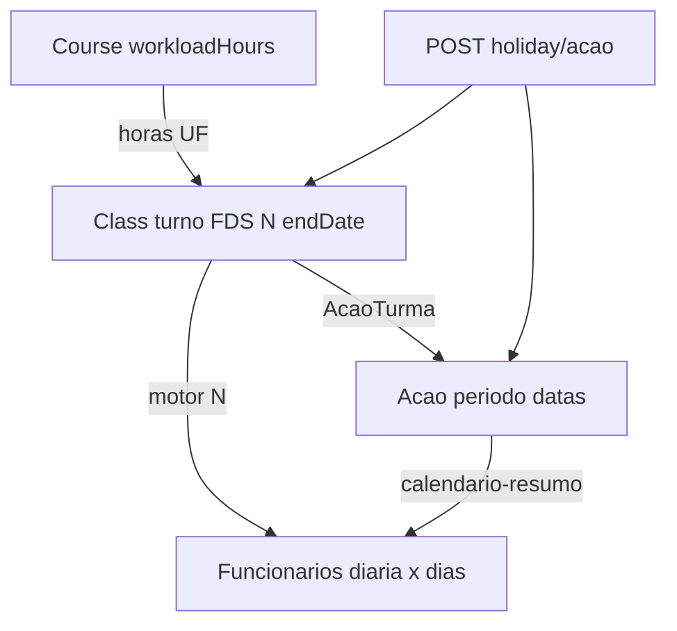

# Sincronia Curso ↔ Período ↔ Turma (ecossistema completo)

**Data:** 2026-05-19 · **Doc:** alinhado a `SPRINT_DOC v2026.05.19.7`

**Referência:** [SPRINTS-CORRECAO-VPS.md](./SPRINTS-CORRECAO-VPS.md) — regra oficial do motor, S5A/B/C, testes.

---

## Fluxo em uma frase

O **curso** fixa a meta em **horas**; a **turma** (turno + calendário) transforma isso em **N encontros letivos** e numa **data fim** real; o **período** paga **diária × dias letivos** (teto N), com aviso se o admin desviar.

---

## Fórmulas (fonte única no backend)

```text
hoursPerSession = hoursBetweenTimes(Class.startTime, Class.endTime)
                  // ex. 07:00–12:00 → 5h (não inventar 6h)

N = ceil(workloadHours_UF / hoursPerSession)
    // ex. 60h ÷ 5h = 12 encontros
    // workloadHours_UF: metade do total se curso MA+PI (ex. 120h → 60h na turma MA)

endDate = último dia ao acumular N dias letivos desde startDate
          (weekendPolicy + global_holidays + class_holidays excluem dias)

diasPagamentoSugeridos = min(diasLetivosNoIntervalo(acao), N)
```

**Presets de turno (sem horas fixas no código):** `teaching-period-presets.util.ts` — Manhã 07:00–12:00, Tarde 13:00–18:00, Noite 19:00–22:00. Horas derivadas do relógio.

**Validação:** `cd backend && npm run motor:verify` (11 cenários).

---

## Contrato do curso (raiz)

| Campo | Papel no motor |
|-------|----------------|
| `workloadHours` | Meta horária; com MA+PI → **metade por UF** na turma |
| `durationDaysMA` / `durationDaysPI` | **Referência opcional** / fallback — **não** define N no motor principal |
| `Class.startTime` / `endTime` | Define `hoursPerSession` e recalcula N se o admin editar |
| `Class.weekendPolicy` | Definido na turma etapa 3 **antes** do resto (`calendarReady`) |
| Feriados S6 + `class_holidays` | Alongam o calendário; **N encontros mantém-se** |

---

## Ordem do wizard — turma etapa 3

1. Política de fins de semana + confirmar calendário (`calendarReady`).
2. Turno (manhã/tarde/noite) → preenche horários via preset.
3. Data início → `POST /classes/preview-end-date` → data fim sugerida.
4. Painel **Resumo operacional do motor** (`formulaLabel`, feriados, aviso de horas).

---

## Modelo de entidades



---

## Pagamento (professor, coordenador, motorista)

| Regra | Implementação |
|-------|----------------|
| Dia pago = dia **letivo** (com aula no calendário) | `countTeachingDaysBetween` / `calcular-dias-efetivos.util.ts` |
| Feriado / ocorrência «sem aula» | **Não** conta como dia letivo nem pago |
| Teto de diárias | `min(dias letivos no intervalo, N)` — `payment-days-suggestion.util.ts` |
| Ocorrência alonga o fim | Diárias sugeridas **permanecem N** (não inflam automaticamente) |
| Default ao vincular funcionário | `suggestedDiasPagamento` de `GET /acoes/:id/calendario-resumo` |

**UI:** aba Funcionários do período — `formulaLabel`, botão «Usar N dias sugeridos», card **Registrar dia sem aula**.

---

## Ocorrências (ao vivo)

| Acção | API | Efeito |
|-------|-----|--------|
| Dia sem aula na turma | `POST /holiday/class/:classId` | Motor N recalcula `Class.endDate`; sync períodos vinculados |
| Dia sem aula no período | `POST /holiday/acao/:acaoId` | Body: `{ dates[], reason, turmaId? }` — mesma regra + `ClassHoliday.acaoId` |
| Notificação | WS `turma_termino_alterado` | Professores + alunos da turma (UX-16) |

**Migration:** `20260519120000_class_holiday_acao_id`.

---

## Profissionais — quem cadastra onde

| Papel | Cadastro «fonte» | No período (UI unificada) |
|-------|------------------|---------------------------|
| Todos (instrutor, motorista, coordenador, etc.) | **Admin → Funcionários** (ou convite aprovado) | `GET /acoes/:id/funcionarios/disponiveis` + `POST /acoes/:id/funcionarios` → card `AcaoFuncionario` |
| INSTRUCTOR (efeito) | Employee + login | `syncTeacherToAcao` nas turmas vinculadas |
| DRIVER (efeito) | Employee + login DRIVER | Carreta nas turmas + grade automática (`weekendPolicy`) + viagens **best-effort** |

APIs legadas (`teachers/pool`, `POST .../drivers/:userId`) permanecem para outras telas; a aba **Equipe e diárias** do período usa **um único fluxo** via Employee.

A diária **não depende** de viagens — o **motor do período** (`calendario-resumo`) define os dias de pagamento. O **portal do motorista** depende de registos `Trip` com `driverUserId` do login.

---

## Motorista — fluxo e portal

**Ordem recomendada (admin):**

1. Curso → Período (`Acao`) com **carreta** e `weekendPolicy`.
2. Turma vinculada ao período (`POST /acoes/:id/turmas/:turmaId` ou criar turma com `acaoId`).
3. Funcionário `DRIVER` com **login** (`User.role = DRIVER`, `employee.userId`).
4. Vincular na aba **Equipe e diárias** (`POST /acoes/:id/funcionarios`).

**Efeitos automáticos:**

- `syncTurmaLinkedToAcao` → datas, carreta, `ensureClassScheduleFromPolicy` (grade seg–sex se vazia e `WEEKDAYS_ONLY`).
- Vincular motorista → `syncDriverForEmployeeOnAcao` → carreta em todas as turmas + `generateTripsForClass` por turma.
- Nova turma após motorista → `tryGenerateTripsForNewTurmaOnAcao` na `addTurma`.

**Viagens (regra ida/volta):** por turma + motorista, no máximo **2** `Trip` PLANNED:

| Leg | Data | Rota |
|-----|------|------|
| Ida | `Class.startDate` | origem da carreta → `Class.cityId` (cidade do curso) |
| Volta | `Class.endDate` | `Class.cityId` → origem |

Origem: `Class.originCityId` ou `Acao.originCidadeId`. Regenerar viagens remove PLANNED legado (viagens diárias antigas) e recria o par ida/volta.

**Portal:** `GET /api/driver/trips` filtra `Trip.driverUserId` — **não** usa `AcaoFuncionario`.

**Regenerar:** `POST /acoes/:id/funcionarios/:employeeId/regenerate-trips` ou botão no card do motorista.

**Diagnóstico local/VPS:**

```bash
cd backend && npx ts-node -r tsconfig-paths/register scripts/diagnose-driver-period.ts \
  --email joao.motorista@qualifica.com --periodo QUALIFICA-SLZ

# Reparo (grade + viagens):
... --repair
```

**Deploy VPS:** um único processo Nest na porta da API; após deploy validar `GET /api/driver/trips` com token do motorista antes de testar só a UI.

---

## Período ↔ turma (MEL-03)

| Situação | Comportamento |
|----------|---------------|
| Vincula turma existente | `POST /acoes/:id/turmas/:turmaId` → sync datas (`syncTurmaLinkedToAcao`) |
| Várias turmas no período | Ocorrência exige `turmaId` no body |
| Datas do período | `dataInicio` / `dataFim` alinhadas a `Class.startDate` / `endDate` |

Frontend: `ModalNovaAcao` em `frontend/app/admin/acoes/page.tsx`.

---

## Endpoints úteis

| Método | Rota | Uso |
|--------|------|-----|
| POST | `/classes/preview-end-date` | Motor na criação da turma |
| GET | `/acoes/:id/calendario-resumo` | N, letivos, `suggestedDiasPagamento`, `formulaLabel` |
| POST | `/holiday/acao/:acaoId` | Ocorrência no período |
| POST | `/holiday/class/:classId` | Ocorrência na turma |
| GET | `/acoes/:id/teachers/pool` | Professores do curso das turmas |
| POST | `/acoes/:id/drivers/:driverUserId` | Motorista + carreta nas turmas |
| POST | `/acoes/:id/funcionarios/:employeeId/regenerate-trips` | Regenerar viagens do motorista no período |
| GET | `/acoes/turmas-by-course/:courseId?groupId&excludeAcaoId` | Turmas elegíveis para vincular ao período |

---

## Ficheiros-chave (repo)

| Área | Ficheiros |
|------|-----------|
| Motor N | `backend/src/common/teaching-days-target.util.ts` |
| Presets turno | `backend/src/common/teaching-period-presets.util.ts`, `frontend/lib/teaching-period-presets.ts` |
| Preview / fim | `backend/src/common/class-teaching-end-date.helper.ts` |
| Pagamento | `backend/src/common/payment-days-suggestion.util.ts` |
| Ocorrências | `backend/src/holiday/holiday.service.ts` |
| Sync período | `backend/src/common/academic-ecosystem-sync.util.ts` |
| Grade / viagens | `backend/src/common/class-schedule-from-policy.util.ts`, `backend/src/trips/trips.service.ts` |
| Diagnóstico motorista | `backend/scripts/diagnose-driver-period.ts` |
| Testes | `backend/scripts/verify-teaching-motor.ts` |

---

## Desenvolvimento local

| Serviço | URL |
|---------|-----|
| Frontend | http://localhost:3010 |
| API | http://localhost:3001 |
| Swagger | http://localhost:3001/api/docs |

```bash
# Infra (se necessário): docker compose -f docker-compose.dev.yml up -d
cd backend && npx prisma generate && npx nest start --watch
cd frontend && npm run dev
cd backend && npm run motor:verify
```

---

## Motorista: próxima viagem, desbloqueio e mapa admin

| Conceito | Comportamento real |
|----------|-------------------|
| **Próxima viagem** (app motorista) | Entre viagens `PLANNED`, escolher a de **menor** `departureDate` (ida antes da volta). Helper: `frontend/lib/driver-trips.ts` → `pickNextPlannedTrip`. A API lista por `departureDate DESC` — **não** usar `.find(PLANNED)` na lista bruta. |
| **Iniciar viagem** | Só no **dia civil** da `departureDate` da viagem escolhida (`trips.service` + `isDepartureDay` no front). |
| **Período `EM_ANDAMENTO`** | Gera/atualiza **diárias** (`acoes.service` `updateStatus`); **não** altera `Trip` nem desbloqueia partida. |
| **Mapa «Motoristas em rota»** (admin) | Só viagens com `Trip.status = IN_TRANSIT` + motorista com `driverUserId` + GPS após «Iniciar viagem» (`driver-location.service` → `getMotoristaAtivos`). |

**Ida vs volta:** `generateTripsForClass` cria duas viagens PLANNED — ida (origem → cidade) e volta (cidade → origem). Data base da ida: `Acao.driverDepartureDate` se preenchido no período; senão `Class.startDate`. Volta: `Class.endDate`.

**Campo opcional no período:** `driverDepartureDate` (wizard logística + edição em `/admin/acoes/[id]`). Ao alterar com motorista já vinculado, o backend regenera viagens PLANNED canónicas do motorista.

---

## Deploy VPS

1. `npx prisma migrate deploy` (incl. `20260519120000_class_holiday_acao_id`, `20260519130000_acao_driver_departure_date`).
2. Rebuild backend + frontend.
3. Teste manual: curso 60h → turma manhã 07–12 → painel «60h ÷ 5h = 12 encontros» → período 12 diárias → ocorrência não aumenta diária sozinha.
4. **Períodos já criados antes do fix:** o motorista pode continuar a ver data errada nas trips antigas até **regenerar** viagens PLANNED — re-vincular motorista no período ou `POST /acoes/:id/funcionarios/:employeeId/regenerate-trips`. O fix do front (próxima viagem = menor data) já mostra a ida se as datas no banco estiverem corretas.
